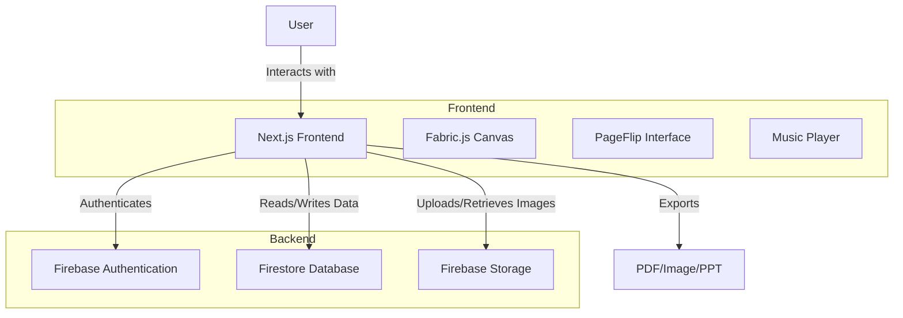
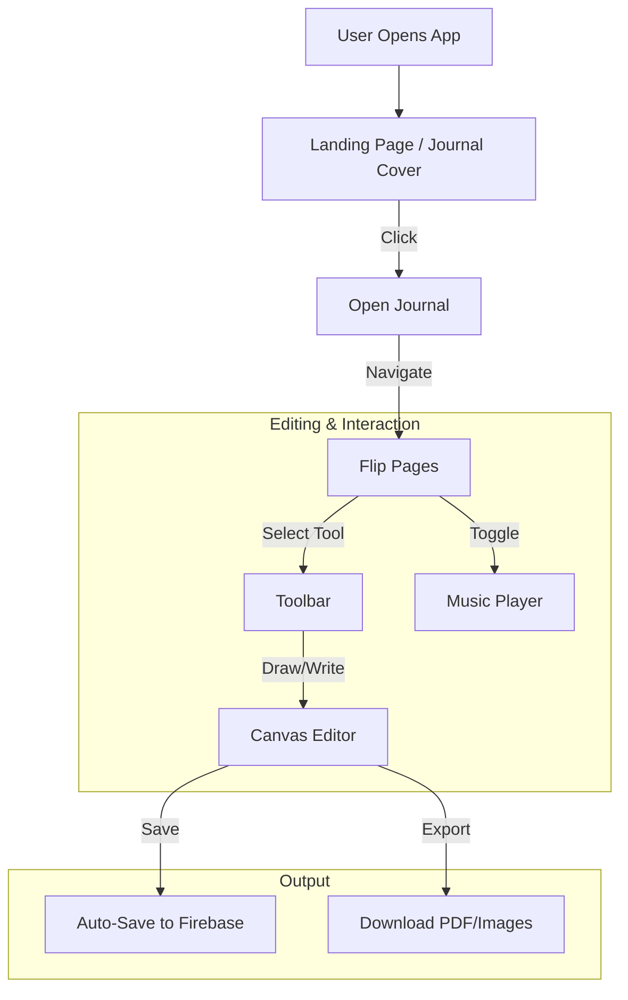

<p align="center">
  
</p>

# [Project Name:Lumin Journal] 🎯

## Basic Details

### Team Name: Code blooded

### Team Members
- Member 1: Reshmi Raj - LBS Institute of Technology for Women, Trivandrum 
- Member 2: Sruthi S Menon - LBS Institute of Technology for Women, Trivandrum 

### Hosted Project Link
code-blooded-l0nyteq47-reshmi-raj-ss-projects.vercel.app

### Project Description
Lumin Journal is a real-time collaborative digital journal that blends the nostalgia of a physical diary with modern web technologies. It features a realistic 3D page-flipping interface, a rich canvas for drawing and design, and built-in music, allowing friends to create and share memories together in an immersive shared space.

### The Problem statement
Digital journaling often feels impersonal and static, missing the tactile joy of physical scrapbooking and the connection of shared storytelling. Existing apps isolate users in solitary text boxes, lacking the creative tools and real-time collaboration needed to truly capture and share moments with friends in a meaningful, artistic way.

### The Solution
Lumin Journal seamlessly bridges this gap by providing a shared, interactive digital journal. It combines the tactile satisfaction of page-flipping with the power of real-time collaborative editing. Users can draw, write, and design together on a synchronized canvas, accompanied by shared music, creating a truly connected and immersive journaling experience accessible from anywhere.

---

## Technical Details

### Technologies/Components Used

**For Software:**
- **Languages used**: TypeScript, HTML, CSS
- **Frameworks used**: Next.js 16 (App Router), React 19, Tailwind CSS 4
- **Libraries used**: 
  - `fabric.js` (Canvas manipulation)
  - `firebase` (Auth, Real-time Database, Storage)
  - `react-pageflip` (Book animation)
  - `lucide-react` (Icons)
  - `html2canvas` & `jspdf` (Export functionality)
- **Tools used**: VS Code, Git, GitHub, Vercel (recommended for deployment)


---

## Features

List the key features of your project:
- **📖 Realistic Book Interface**: Smooth, 3D page-flipping effect that mimics a physical journal.
- **🎨 Advanced Canvas Editor**: Full creative freedom with Fabric.js—draw, move, resize, and layer simple shapes, text, and images.
- **🤝 Real-time Collaboration**: Changes sync instantly across all users, allowing simultaneous journaling sessions.
- **🎵 Built-in Music Player**: Curated Lo-Fi beats to enhance the journaling atmosphere.
- **📤 Multi-Format Export**: Save your creations as PDF, PNG, or PowerPoint presentations.
- **🛠️ Custom Toolbar**: Intuitive access to pens, markers, stickers, and layout tools.

---

## Implementation

### For Software:

#### Installation
```bash
git clone https://github.com/Reshmirajs/hackathon.git
cd hackathon
npm install

# Setup Environment Variables
# Create a .env.local file in the root directory
# See FIREBASE_SETUP.md for details

```

#### Run
```bash
npm run dev
```


## Project Documentation

#### Screenshots (Add at least 3)


*The landing page featuring the realistic 3D book interface.*


*The rich canvas editor where users can draw, add shapes, and text.*


*The custom toolbar providing easy access to all creative tools.*

#### Diagrams

**System Architecture:**


*The architecture consists of a Next.js frontend hosted on Vercel, interacting with Firebase for real-time data persistence, authentication, and file storage.*

**Application Workflow:**


*The user starts at the cover, flips through pages to access the canvas, uses the toolbar to create content which is auto-saved, and can optionally play music or export their work.*

---


## Project Demo

### Video
https://drive.google.com/drive/folders/1f3ObE1xVlvGKI7_erhp5i4c7ozYjOFKV?usp=sharing

---

## AI Tools Used (Optional - For Transparency Bonus)

If you used AI tools during development, document them here for transparency:

**Tool Used:** Google Gemini / GitHub Copilot

**Purpose:** 
- Code generation for complex components (Canvas logic, Book flip effect).
- Documentation restructuring and refinement.
- Debugging Firebase integration issues.

**Key Prompts Used:**
- "Fix event propagation issues in Fabric.js canvas"
- "Implement a realistic page-turning effect using react-pageflip"
- "Generate a comprehensive README for a hackathon project"

**Percentage of AI-generated code:** Approximately 40%

**Human Contributions:**
- Core application logic and state management.
- UI/UX design and aesthetic choices.
- Integration of multiple libraries (Fabric.js + PageFlip).
- Testing and final polish


Made with ❤️ at TinkerHub
